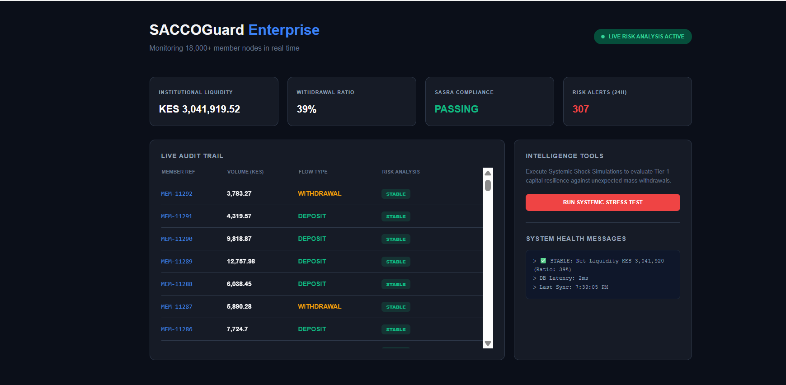

# SACCOGuard Enterprise 🛡️
**Real-time Liquidity Intelligence & Risk Mitigation Engine**

SACCOGuard is a high-performance Fintech solution designed to solve the "Liquidity Blindspot" in large-scale Savings and Credit Cooperatives (SACCOs). It provides automated oversight for institutions with 18,000+ members, ensuring financial resilience through data-driven foresight.

## 🚀 Key Features
* **Automated Risk Watchdog:** Uses Spring Scheduling to autonomously monitor withdrawal-to-deposit ratios every 5 seconds.
* **Systemic Stress Testing:** Built-in "Black Swan" simulator to evaluate Tier-1 capital resilience against mass withdrawal events.
* **Liquidity-Linked Loan Intelligence:** Dynamically flags high-value loan approvals when cash buffers drop below safety thresholds.
* **SASRA Compliance:** Real-time auditing of liquidity ratios against regulatory standards.

## 🛠️ Technology Stack
* **Backend:** Java 17, Spring Boot 3.x
* **Persistence:** Spring Data JPA, H2 In-Memory Database (for high-speed stream processing)
* **Logic:** Scheduled Task Automation, Stream API for risk calculations
* **Frontend:** Real-time Dashboard (Vanilla JS, CSS3, REST API Integration)

## 💡 Why This Matters
Traditional SACCOs often realize they have a liquidity crisis only during monthly audits. **SACCOGuard** changes the narrative from reactive accounting to proactive risk management. By identifying "Run on the Bank" patterns as they happen, the system protects member deposits and informs smarter loan disbursement decisions.

## ⚙️ Installation
1. Clone the repo: `git clone https://github.com/nahorfelix/saccoguard-enterprise-risk-engine.git`
2. Run the app: `./mvnw spring-boot:run`
3. Access the Dashboard: `http://localhost:8080`